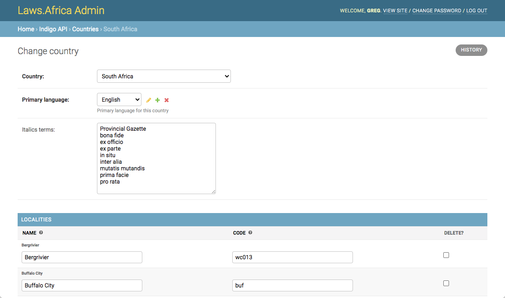

# Countries and localities

## Countries

The countries list determines which countries are available in the site. To see the list of enabled countries:

1. Open the admin interface
2. Under **Indigo API** click **Countries**

### Adding a new country

To add a new country:

1. Open the admin interface
2. Under **Indigo API** click **Countries**
3. Click **Add country**
4. Choose the **Country** from the dropdown list
5. Choose the **Primary language** for the country
6. If your language is not listed, click the plus icon next to the list and add the language from the dropdown.
7. \(Optional\) Add localities in the localities list \(see [Localities](countries-and-localities.md#localities) below\)
8. \(Optional\) Add publications in the publications list \(see Publications below\)
9. Click Save

### Italics terms

Some countries have specific terms which are always _italicised_ in their legal tradition. For example, in South Africa, latin terms such as _pro rata_ and _in situ_ are always italicised. The platform can be configured to do this italicisation automatically.

To add terms to be automatically italicised:

1. Open the admin interface
2. Under **Indigo API** click **Countries**
3. Click on the name of the country you wish to add terms for
4. Add the terms to the **Italics terms** box, one term per line
5. Click **Save**

### Editing a country

To edit an existing country:

1. Open the admin interface
2. Under **Indigo API** click **Countries**
3. Click on the name of the country you wish to edit
4. Make the necessary changes
5. Click **Save**

### Publications

Publications are the names of the publications that are presented to a user when they are creating or editing a Work. It is useful to enter common publication names to save the user from having to type them.

To edit the publications for a country or add a new one:

1. Open the admin interface
2. Under **Indigo API** click **Countries**
3. Click on the name of the country you wish to edit
4. Add or edit publications
5. To delete an existing publication, check the **Delete** checkbox
6. Click **Save**

## Localities

Localities are places such as provinces, counties or municipalities that are within a country. Localities have their own tasks and workflows.

All localities must have a unique code within the country. This code is combined with the country code to generate a _place code_, which is used in the FRBR URI for the works in that locality.

For example, in South Africa, the municipality of Cape Town has the official  code of `cpt`, which is given by the Municipal Demarcation Board. Combined with the code for South Africa, the full place code for  Cape Town, South Africa is `za-cpt`.


Use official locality codes wherever possible. These might come from your government or from the International Standards Organisation \(IOS


To edit the localities for a country or add a new one:

1. Open the admin interface
2. Under **Indigo API** click **Countries**
3. Click on the name of the country you wish to edit
4. Add or edit localities
5. To delete an existing locality, check the **Delete** checkbox
6. Click **Save**


A locality cannot be deleted if it contains works. Delete the works first.


