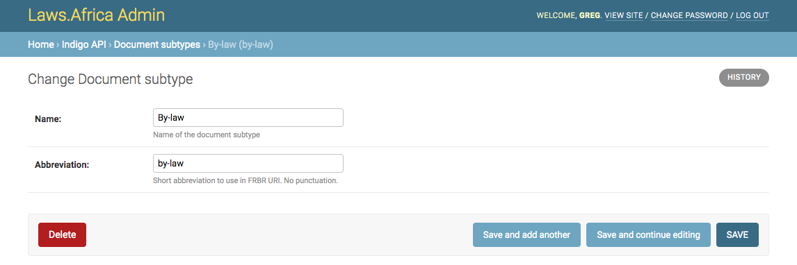

# Document subtypes

Document subtypes allow you to specify different types of legislation, such as regulations, notices, etc. A subtype has a unique abbreviation that is used in the FRBR URI of works of that subtype.

## Adding a new document subtype

To add a document subtype:

1. Open the admin interface
2. Under **Indigo API** click **Document subtypes**
3. Click **Add document subtype**
4. Fill in the **name** and **abbreviation**
5. Click **Save**


Use only lowercase in the **abbreviation** and replace spaces with** **hyphens (-).


## Editing a document subtype

Editing an existing document subtype will automatically update all the linked works.

To edit a document subtype:

1. Open the admin interface
2. Under **Indigo API** click **Document subtypes**
3. Click on the document subtype you want to edit&#x20;
4. Make your changes
5. Click **Save**

## Deleting a document subtype

To delete a document subtype:

1. Open the admin interface
2. Under **Indigo API** click **Document subtypes**
3. Click on the document subtype to delete
4. Click **Delete**


You cannot delete a document subtype that is associated with works. Delete the works first.

