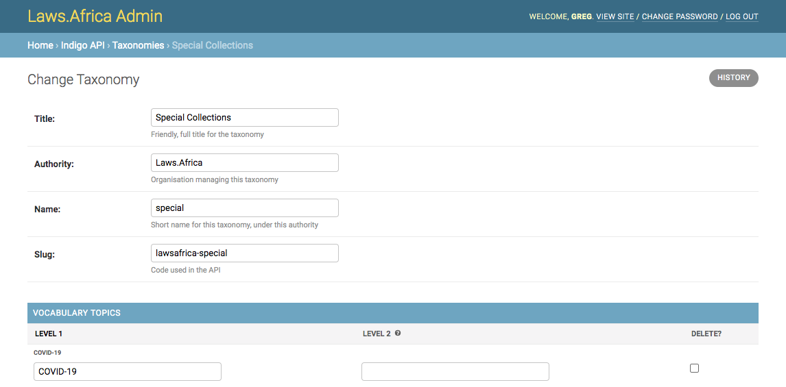

# Taxonomies

Taxonomies are used to group works into collections. The platform supports multiple taxonomies and a work can belong to or any number of taxonomies.

## About taxonomies

A taxonomy is a collection of labels called **topics**. A topic can have one or two levels, forming a shallow hierarchy. 

A taxonomy has these properties:

* Title: the descriptive title of the taxonomy
* Authority: the organisation that is responsible for this Taxonomy
* Name: the short name for the taxonomy, based on the title
* Slug: a code name for the taxonomy used in the API. This is generated automatically from the authority and the name.
* Topics: topics with a level 1 name, and \(optionally\) a level 2 name

For example, here is a small two-level subject area taxonomy called 'Legislative Subject Areas':

* Title: Legislative Subject Areas \(title\)
* Topics:
  * Level 1: Money and Business \(level 1\)
    * Level 2: Contracts
    * Level 2: Taxation
  * Level 1: People and Work
    * Level 2: Employment
    * Level 2: Health

## Adding a new taxonomy

To add a new taxonomy:

1. Open the admin interface
2. Under **Indigo API** click on **Taxonomies**
3. Click **Add Taxonomy**
4. Enter the **Title,** a user-friendly title for the taxonomy
5. Enter the **Authority**, usually your organisation name
6. Enter the **Name**, based on the title. Use only lowercase letters and no spaces.
7. The slug will be generated automatically.
8. Enter the **Topics** for the taxonomy.
   1. Each topic must have a **level 1** name.
   2. Topics can optionally have a **level 2** name.
9. Click **Save**

## Editing a taxonomy

To edit an existing taxonomy:

1. Open the admin interface
2. Under **Indigo API** click on **Taxonomies**
3. Click on the taxonomy to edit
4. Make your changes
5. To delete a topic, check the **Delete** checkbox
6. Click **Save**

## Deleting a taxonomy

Deleting a taxonomy will remove it from any works linked to it. To delete a taxonomy:

1. Open the admin interface
2. Under **Indigo API** click on **Taxonomies**
3. Click on the taxonomy to delete
4. Click **Delete**

