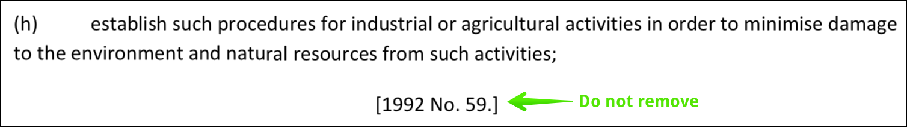
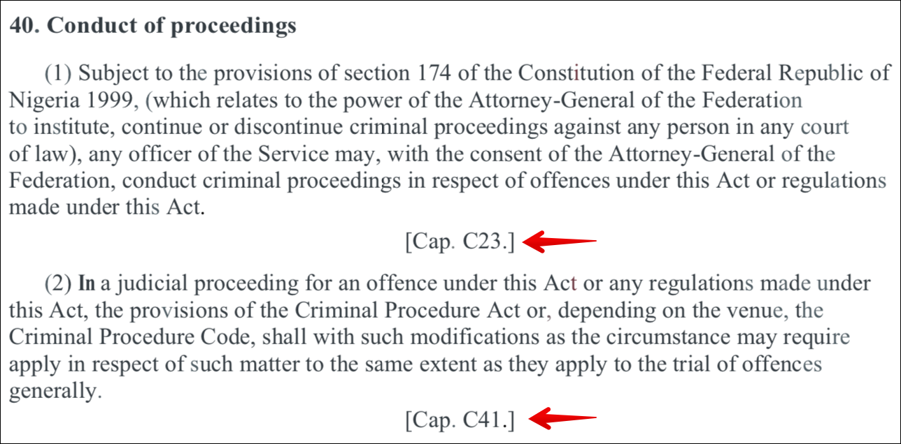
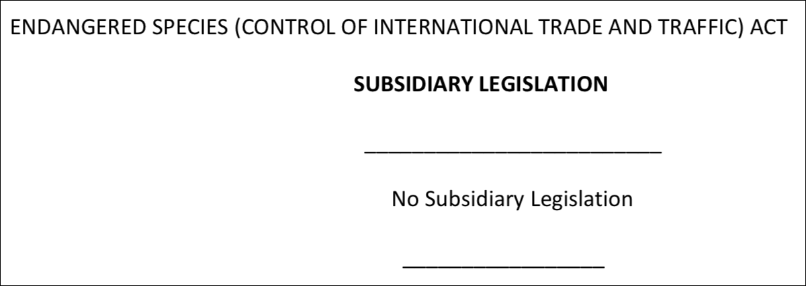
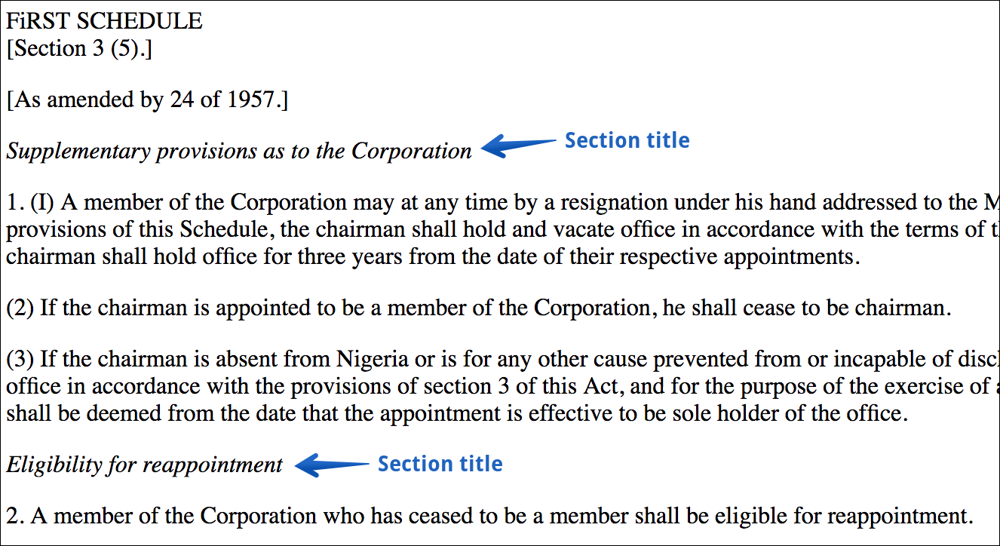
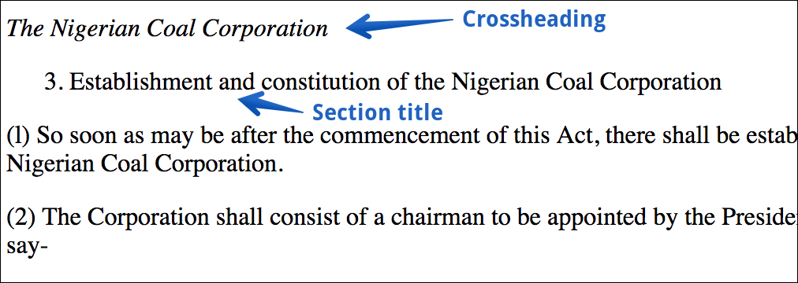
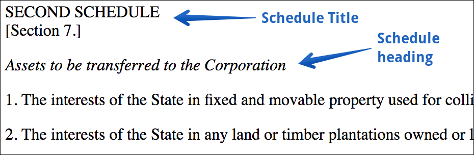

# Nigeria

## Cleaning up

### Editorial remarks


Do not remove remarks that indicate amendments, such as `[1992 No. 59]`.

Do use \[\[double squares\]\] – `[[1992 No. 59]]`\(the text will go green to show that it's an editorial remark\).




Remove remarks that reference Caps and Schedules.



### Empty Subsidiary Legislation

Remove the headings for empty subsidiary legislations, including the primary Act's title, if it's included.



## Use Sections in Schedules

Prefer to use Sections in Schedules rather than Crossheadings.


If a title appears to belong to only one numbered Section, mark it as a Section, not as a Crossheading.




Markup these sections like this:

```text
1. Supplementary provisions as to the Corporation

(1) A member ofthe corporation may at any time ...

(2) If the chairman is appointed to be ...

(3) If the chairman is absent from ...

2. Eligibility for reappointment

A member of the Corporation who ...
```

## Crossheadings

Add a `CROSSHEADING` where the source documents use _italics_ for crossheadings that cover multiple sections.


DO NOT italicise the Crossheading using `//`as the platform will do it for you.




## Schedule Titles and Headings

Use Schedule Headings where possible, rather than Crossheadings.  



```text
SCHEDULE - Second Schedule (Section 7.)
Assets to be transferred to the Corporation

PARA 1. The interests of the State in fixed and movable property ...

PARA 2. The interests of the State in any land or timber ...
```


The Schedule heading comes on the next line immediately after the keyword `SCHEDULE`.



Use Sentence case for the Schedule title, and put any reference to the referring section in brackets.


