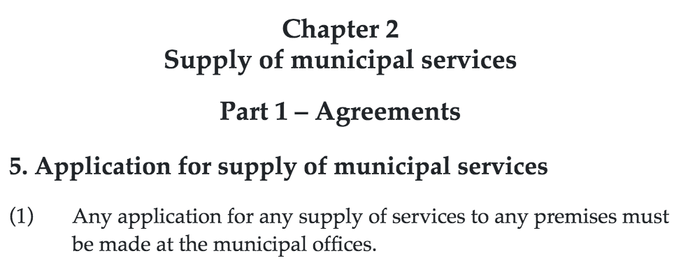

# Chapters and Parts

Chapters and parts are often used to sections. Sometimes a chapter will contain parts, and sometimes parts will contain chapters.

## How to markup chapters

1. Enter Edit mode
2. On one line, start a chapter with `CHAPTER <number> - <heading>`
3. The heading is optional and should use [Sentence case](https://docs.laws.africa/style-guides/south-african-by-laws#what-is-sentence-case), not ALL CAPS.
4. Put the contents of the chapter on the following lines.

**Example**

```text
CHAPTER 2 - Interpretation
```

## How to markup parts

1. Enter Edit mode
2. On one line, start a chapter with `PART <number> - <heading>`
3. The heading is optional and should use [Sentence case](https://docs.laws.africa/style-guides/south-african-by-laws#what-is-sentence-case), not ALL CAPS.
4. Put the contents of the part on the following lines.

**Example**

```text
PART 2 - Tariffs
```

## Exercise

1. Copy and paste the following following content into your editor.
2. Correct it so that it shows up like the screenshot below.
   1. Chapter 2 should have the correct heading \(using Sentence case\)
   2. Part 1 should have the correct heading \(also using Sentence case\)
   3. Part 1 should contain section 5 and subsection 5\(1\).

```text
2
SUPPLY OF MUNICIPAL SERVICES

Part: 1
Agreements

5. Application for supply of municipal services

(1) Any application for any supply of services to any premises must be made at the municipal offices.
```

Your goal is to make it look like this:



