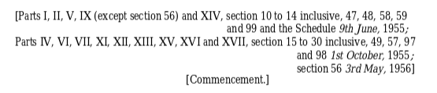
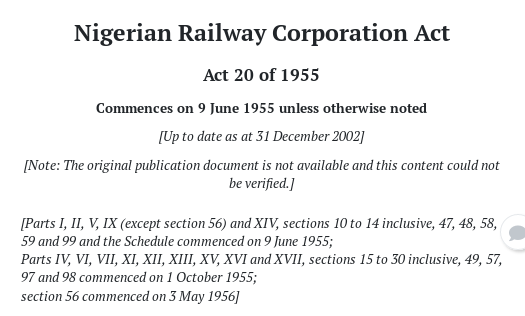

# Multiple commencement dates

The automatically generated coverpage of each Act gives the main \(often the only\) commencement date, followed by '**unless otherwise noted**'. So unless we explicitly state otherwise, end users should be able to trust that all the provisions of a given work have been in force since the main commencement date.

Sometimes different provisions of a work commence on different dates, and it's important that we clearly communicate the different provisions and dates to end users.

## How to record multiple commencement dates

1. Get the commencement information \(from the consolidation or gazette/s\).
2. Make an editorial remark at the top of the work:  – give all the commencement dates \(including the main commencement date\)  – give each provision that commenced on each of those dates.
3. At each of the provisions that commenced on a date other than the main commencement date, make an editorial remark that repeats the commencement information for that provision.


Include as much information as you have available, including the number and year of the commencement notice.


## Example

Taken from [https://edit.laws.africa/documents/3132/](https://edit.laws.africa/documents/3132/) on [https://edit.laws.africa/works/ng/act/1955/20/](https://edit.laws.africa/works/ng/act/1955/20/).

