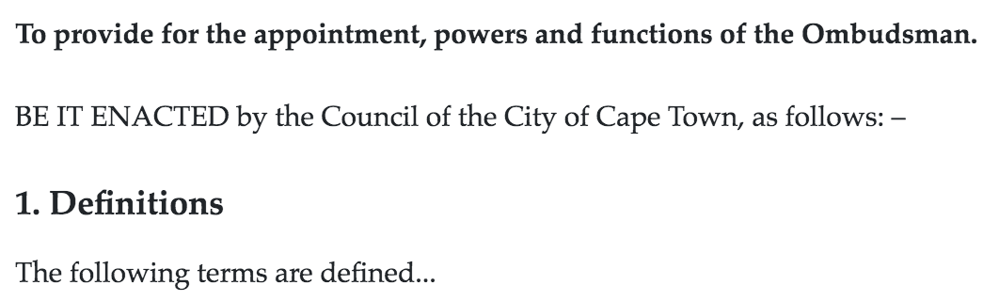

# Preface and Preamble

The Preface and Preamble are optional components that come at the start of a piece of legislation, before the main body.

The Preface, if present, always comes before the Preamble.

## How to add a Preface

1. Enter Edit mode
2. Put the keyword `PREFACE` on a line on its own, before `BODY` and before `PREAMBLE`, if it is present.
3. Place the content of the Preface after the keyword.
4. If present, include the long title in the Preface using the keyword `LONGTITLE`.


The Preface will appear in the Table of Contents on the left, but it won't have a heading in the document itself. 


### Example

```text
PREFACE

LONGTITLE An act to make provision for procedures and related matters in criminal proceedings.
```

## How to add a Preamble

1. Enter Edit mode
2. Put the keyword `PREAMBLE` on a line on its own, before `BODY` and after `PREFACE`, if it is present.
3. Place the content of the Preamble after the keyword.


The Preamble will appear in the Table of Contents on the left. In some countries, it may also show up as a heading in the document, depending on the tradition of the country.


### Example

```text
PREAMBLE

BE IT ENACTED by the Council of the City of Cape Town as follows:—
```

## Exercise

1. Copy and paste the text below into your editor.
2. Fix the ordering and the markup so that the Preface comes before the Preamble, and the content follows both of them, as in the screenshot below.
3. Ensure that 'BE IT ENACTED' is part of the Preamble, not the Preface.

```text
BODY

LONGTITLE To provide for the appointment, powers and functions of the Ombudsman.

BE IT ENACTED by the Council of the City of Cape Town, as follows: –

1. Definitions

The following terms are defined...
```



