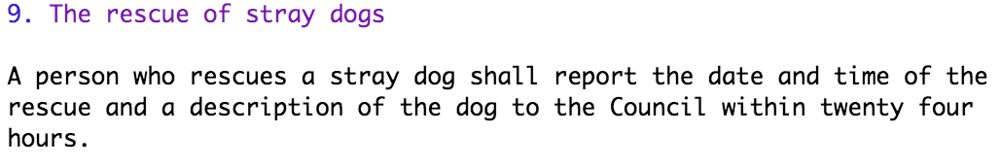

# What is Akoma Ntoso

[Akoma Ntoso](http://akomantoso.org/) is an XML markup standard for legislative documents. It captures rich metadata and structural information about legislation and allows a computer to automate common tasks.

Akoma Ntoso is a non-proprietary, open standard managed by OASIS.

Here's an example of what it looks like:

```markup
<section id="section-9">
  <num>9.</num>
  <heading>The rescue of stray dogs</heading>
  <content>
    <p>
      A person who rescues a stray dog shall report the date
      and time of the rescue and a description of the dog
      to the Council within twenty four hours.
    </p>
  </content>
</section>
```

### Content, Structure and Presentation

Akoma Ntoso separates content and structure from presentation.

* **Content** is the words in a document \(the white text in the example above\).
* **Structure** is the hierarchy, such as parts, chapters and sections \(the blue text in the example above\).
* **Presentation** is the appearance and formatting of the document, such as font, text size, bold, underline and text justification. It's not included in the above example at all.

Treating these three elements separately makes it very easy to apply different presentations for different use cases, such as desktop, mobile and print.


### Working with Akoma Ntoso

The Laws.Africa editor makes working with Akoma Ntoso easy. So easy, that you never even have to see it! You don't have to worry about the complexity of XML or ensuring that the table of contents is up to date, it's handled for you.

Instead, you work with a simplified version of the document that focuses just on content and structure, that looks like this:



