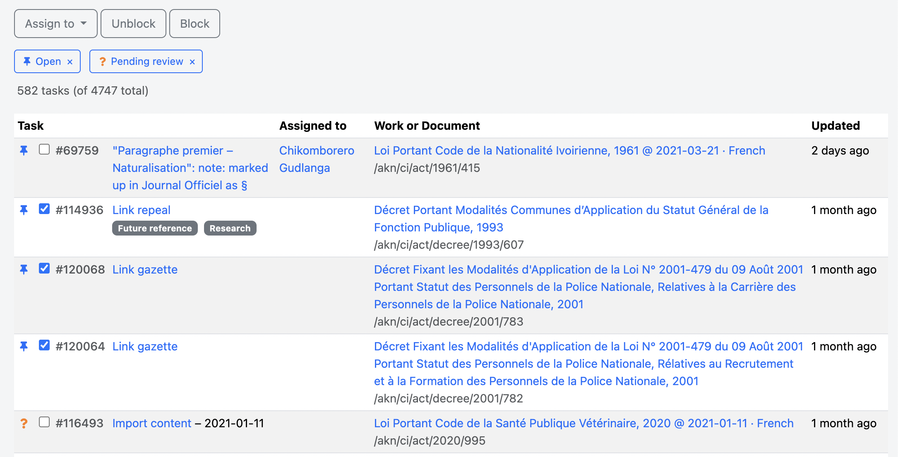

# Tasks

In a place's tasks page, each task has a checkbox next to it.&#x20;

Once you check one of these boxes, the bulk actions will appear.

<figure><figcaption></figcaption></figure>

For now, these include:

* Blocking and unblocking — the system will try its best to do what you've told it to, and ignore nonsensical instructions (like blocking a blocked task).
* Assigning multiple tasks to one person, or unassigning them — if a 'pending review' task is included in the selection, only users with a Reviewer badge will be listed as optional assignees.


Use the filters on the left of the listing view to find the group of tasks you want to work with.

