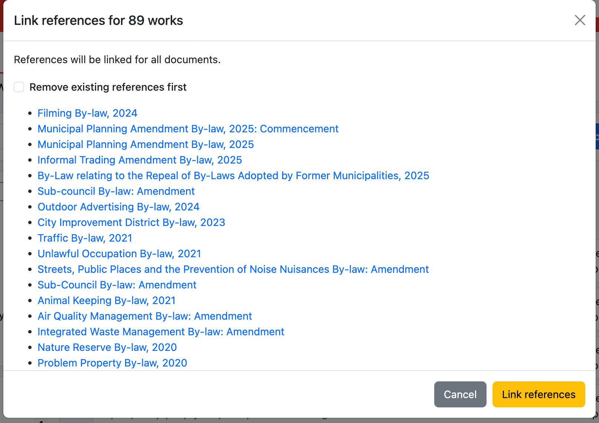

# Link references for selected works

Linking references is the same as using the **Analysis > References > Find references** functionality in the document editor view.

Linking references will:

* (Optionally) remove existing references in the document content
* find and link new references in the document content

Just like when linking references on a single document, the changes must be signed off.

<figure><figcaption></figcaption></figure>

