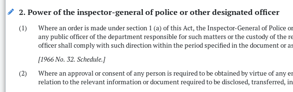

# Fixing all-caps headings

1. In View mode, click 'Analysis | Make headings Sentence case'.
2. Review and fix headings.
3. Don't forget Step 2.

### Tips

* Only run **Make headings Sentence case** when the headings are all-caps.
* Run it as a first step, then check individual headings and re-capitalise proper nouns and acronyms.
* Never run it as a last step.
* Quick-edit sections that need words re-capitalised by clicking the pencil next to the heading.




For more guidance on sentence case, see the [Laws.Africa style guide](../style-guides/laws.africa.md#headings).


## Exercise

Copy and paste the text below into the editor.

```
SEC 1. - DEFINITIONS

  Blah blah blah.

SEC 2. - NATURAL RESOURCES IN NIGERIA

  Blah blah blah.

SEC 3. - THE SABC'S INVOLVEMENT IN THE OFFICIAL PROGRAMME

  Blah blah blah. The Official Programme will be very official.

SEC 4. - HOW THIS WILL AFFECT REGULAR PEOPLE

  Blah blah blah.


```

1. Click Update.
2. Click 'Analysis | Make headings Sentence case'.
3. Quick-edit sections 2 and 3 to fix their headings.
