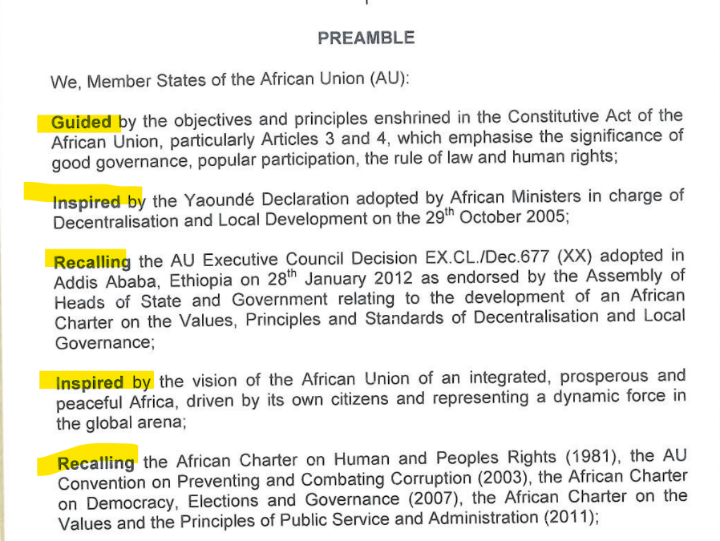

# How to handle different language documents

### How to import a document in a language other than English

If a document exists in more than one language and you wish to add different versions of the same document:&#x20;

* Open the work on the overview page.
* Scroll down to the point(s) in time.
* **Create a new document at the same point in time**. To do this click Manage points in time.

<figure><figcaption></figcaption></figure>

* Click "import document."

<figure><figcaption></figcaption></figure>

* Select the appropriate language.
* Upload the .docx version of the document. (Use the PDF to check against as the authoritative source.)&#x20;
* Select the section display.
* Click "go for it" to import the document.

<figure><figcaption></figcaption></figure>

### How to change the short title of a document to the relevant language

* On the works page change the language of the short title.
* &#x20;To do this at top right corner of page Click Settings, Properties, change the Short Title into the language of the work as it appears on the work.&#x20;
* For French documents do not capitalise words such as aux, pour, le, la, l’, à.
* Follow the instructions on how to deal with headings because these can be applied to titles. Style points that apply to all our projects can be found there [https://docs.laws.africa/style-guides/laws.africa#headings](https://docs.laws.africa/style-guides/laws.africa#headings)
* check how a word is capitalised in the content of the document for guidance.
* &#x20;Pay close attention to correct accents on letters for non-English works.
* &#x20;Click close. Click save draft.

<figure><figcaption></figcaption></figure>

\
\

<figure><figcaption></figcaption></figure>

### &#x20;
