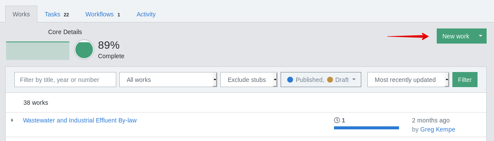
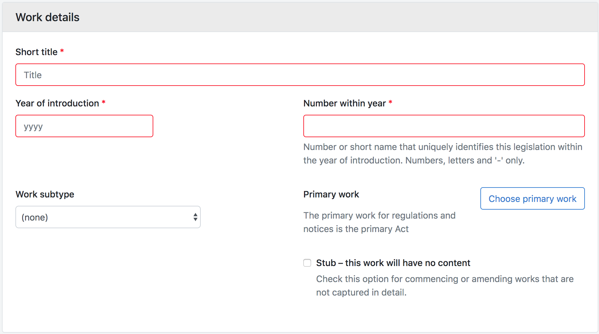

# Creating and editing works

## Creating a new work

To create a new work, open the works page for the appropriate country or locality, and then click **New work**.

Then fill in the details as described below.

To edit an existing work, click **Edit work** on the work detail page.

## Edit the Work details

The work details are the core, basic details for a work. Items marked with a red asterisk are required and cannot be blank.

### Short title

This is the short title of the work, such as "Accountants Act". The official short title of an Act is usually specified in a the Act's "Short title" section. If there isn't one, refer to the contents page of the original publication \(Gazette\). 


Short titles normally use Title Case. Don’t use ALL CAPS.


### Year of introduction

This is the year in which  the work was first introduced into Parliament or Council.

For example: for "Act 5 of 2012", the year of introduction is 2012.

### Number within year

This is the number of the work within the year of introduction. Together with the year, it uniquely identifies the work.

For example: for "Act 5 of 2012", the number within the year is "5".

#### Numbers for by-laws and other works without numbers

South African by-laws, and other works, sometimes don't have numbers. In this case, use the title of the work, but with the following changes:

* use all lowercase
* replace all spaces with hyphens
* remove references to the name of the municipality or town, since this is already captured
* remove the word "by-law" and phrases such as "relating to"

For example: for the "Cape Town By-law relating to the consumption of Strawberries", the number would be "consumption-of-strawberries". Yum, strawberries. 🍓

### Work subtype

Leave this blank for Acts. For other types of works, choose an option from the dropdown list. Options depend on the country. Examples include by-law, legal notice \(ln\) and statutory instrument \(si\).

### Primary work

Leave this blank for Acts.

For subsidiary legislation and regulations, this indicates the work to which the subsidiary legislation or regulation is related.

To choose a primary work, click **Choose primary work** and search for the Act in terms of which these regulations have been promulgated.


Do not use Primary work to link an amending Act to the Act which it amends. Instead, use the amending Act to create a new point in time for the amended Act. 




### Stub

Marking a work as a stub indicates that we will not capture the content of the work, we will only capture the work metadata.

Check the stub checkbox if this is work only amends, commences or repeals another work, and has no substantive provisions of its own.

## Edit the Publication details

The publication details refer to when and where the work was first published in an official government publication, such as the Government Gazette.

### Publication date, name and number

For the **publication date**, use the date of the original publication.

For the **publication name**, use the name of the publication, such as Government Gazette. Choose an option from the dropdown list, if possible.

The **publication number** is the number of the publication or gazette. Together with the publication date, this uniquely identifies the publication.


Do not use volume number, part number, or supplement number for the publication number.


### Attaching a publication document

Having a record of the work as it was originally published by the relevant authority enables end users to verify any content published using the platform.

Once the publication date, name and number have been filled in, an option to 'Attach document' will appear in places where we already have a collection of  gazettes and the relevant gazette was found in that collection. You can Ctrl/Cmd+click the link ending in `.pdf` to open it in a new tab and verify that this is the right gazette before attaching it.

If the option does not appear, double-check the details you have entered. If you're certain of them and have a copy of the original work to hand, upload it using the `Browse...` or similar option.

## Edit the Commencement and Assent details

Enter the **commencement** and **assent dates**.

If the work has a commencing work, click **Choose commencing work** and search for it. 


The commencing work must be created separately on the platform.




## Provide Repeal details

If the work has been repealed, click **Choose repealing work** and search for the repealing work.

The date will auto-fill as the date of commencement of the repealing work. Double-check that this is the right date before saving.


The repealing work must be created separately on the platform.


