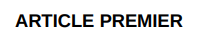

# Côte d'Ivoire

**Ce qu'il faut savoir en Côte d'Ivoire**

* **Hiérarchie de documents**:
* &#x20;Livre (Book), Titre (Title), Sous-titre, Chapitre (Chapter), Section, Sous-section, Article&#x20;
* Livre 1 apparaît comme **LIVRE PREMIER** dans le docx, marquer comme `LIVRE premier`
* Chapitre 1 apparaît comme **CHAPITRE PREMIER** dans le docx, marquer comme `CHAP premier`
* &#x20;Article 1 apparaît comme  **ARTICLE PREMIER** dans le docx, marquer comme`ART premier`&#x20;
* Title 1 apparaît comme **TITRE PREMIER** dans le docx, marquer comme TITRE `premier`
* **BUT** Section 1 apparaît comme  **SECTION PREMIERE** dans le docx, marquer comme **PARTIE PREMIERE** marquer comme `PART première`
* Les mots français pour BOOK (Livre), CHAPTER (Chapitre), TITLE (Titre) et PART (Partie) apparaîtront automatiquement traduits sur l'écran de visualisation lorsque vous les marquerez de la manière habituelle, par exemple Chapter apparaîtra automatiquement comme Chapitre lorsque vous le marquerez en utilisant CHAP.
* Marquer comme **Sous-titre** comme **SUBTITLE**
* Marquer comme **Sous-section** comme **SUBSEC**
*   **Historique de la législation**

    Les références à l'historique de la législation, aux amendements/modifications figurant en tête de l'ouvrage doivent être reprises sous forme d'annotation dans la préface.

<figure><figcaption></figcaption></figure>

En mode édition:

<figure><figcaption></figcaption></figure>

En mode affichage:

.png>)

Exemple d'annotation de plusieurs amendements [https://edit.laws.africa/documents/15249/](https://edit.laws.africa/documents/15249/)

**Modification des Amendements**

Le mot (nouveau) sera ajouté entre crochets après le numéro de l'article. L'annotation avec les détails du travail de modification doit apparaître immédiatement sous le titre de l'article, sans crochets ronds.

<figure><figcaption></figcaption></figure>

En mode édition:

<figure><figcaption></figcaption></figure>

En mode affichage:

<figure><figcaption></figcaption></figure>

**Remplacer les titres en MAJUSCULES par des titres en minuscules.**

Exemple de texte à modifier&#x20;

<figure><figcaption></figcaption></figure>

En haut de l'écran, cliquez sur Analyse, puis sur Faire des intitulés des cas de phrases.

<figure><figcaption></figcaption></figure>

Text of headings to sentence case and accents are automatically inserted:

<figure><figcaption></figcaption></figure>

Vous devez encore remplacer les mots PREMIER par premier. Correction de l'annotation :

<figure><figcaption></figcaption></figure>

**Paragraphe qui contient des articles**


<figure><figcaption></figcaption></figure>

En mode édition : marquer comme SOUS-PARTIE, inclure « paragraphe » dans le numéro (pas dans le titre))

<figure><figcaption></figcaption></figure>

In view mode:

<figure><figcaption></figcaption></figure>

**Numérotation irrégulière des documents : annotation à insérer**

Mode édition:

```bluebell
{{*[Attention: numérotation comme à l'original.]}}
```

**Annexes**&#x20;

Se trouve à la fin des travaux, à marquer comme un HORAIRE

**Tableau et formulaires en Annexe**

**Les Tableaux** dans le document des annexes **doivent** être importées.

**Formulaires**

Les formulaires ne peuvent être reproduits

Pour les formulaires, veuillez continuer à insérer la rubrique de forme et de style comme d'habitude, avec une note éditoriale (en français) en dessous, comme indiqué ci-dessous :


```
ANNEXURE - Annexure 1
    SOUS-TITRES Formulaires
    {{*[Note éditoriale : Les formulaires n’ont pas été reproduits.]}}
```

Si les formulaires sont modifiés/substitués par la suite, une annotation doit être incluse à cet effet.


````
  {{*[Note éditoriale : Les formulaires n’ont pas été reproduits.]}}

  {{*[Le formulaire 4 est remplacé par .........]}}
```
````

**Application des Amendments**

Le mot **(nouveau)** est ajouté entre parenthèses à l'article après le numéro pour indiquer qu'un article entier a été remplacé.

L'annotation est placée sous le numéro de l'article et au-dessus du texte.

&#x20;Mode d'affichage ↓

&#x20;

Mode édition ↓

<figure><figcaption></figcaption></figure>

&#x20;En cas de remplacement d'un article, utiliser le mot **remplacé**

En cas d'abrogation d'un article, utiliser le terme **abrogé**

Lorsqu'un article est modifié ou remplacé plusieurs fois, les annotations sont regroupées en une seule annotation consolidée.

Mode d'affichage ↓

&#x20;.png>)

Mode édition ↓

<figure><figcaption></figcaption></figure>

&#x20;Veuillez lire la section « Comment insérer une annotation créée automatiquement dans Laws.Africa ». Guide de l'éditeur.

[https://docs.laws.africa/managing-works/amending-works/annotating-the-amendments](https://docs.laws.africa/managing-works/amending-works/annotating-the-amendments)


