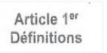
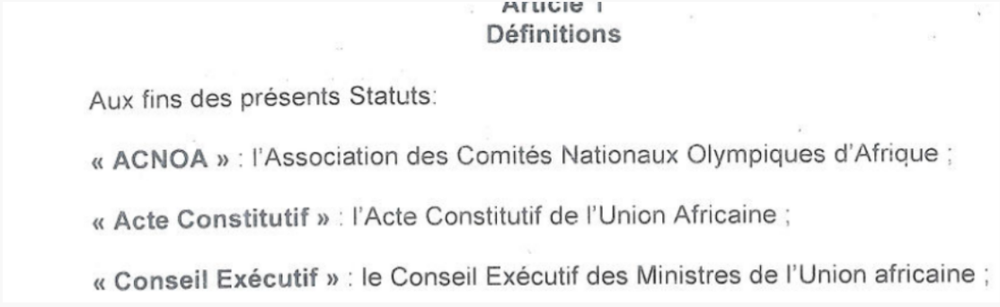

# Documents in languages other than English

### Clean up

* French and Portuguese words for CHAPTER, ARTICLE, PART will automatically appear translated on the view screen when you mark them up in the usual way eg. French Chapter will automatically come up as Chapitre when you mark it up using CHAP
* **French language:** where Article 1 appears as **Article 1er** (superscripted) or as **ARTICLE PREMIER** in the pdf, then mark up as Article 1 and not as 1er or as Premier

<figure><figcaption></figcaption></figure>

* .png>)
* **Definitions:** markup in bold is not presently supported. French documents use French version quotation marks « or » as they appear in the document. Do not mark up as italics or bold.

* In French documents sometimes l’ (small letter el apostrophe) imports as small letter i’( i apostrope. In such a case go to edit screen, click edit, click find and replace and change all i’ to l’ . Eg. i'Union. Should be changed to l’Union.&#x20;
