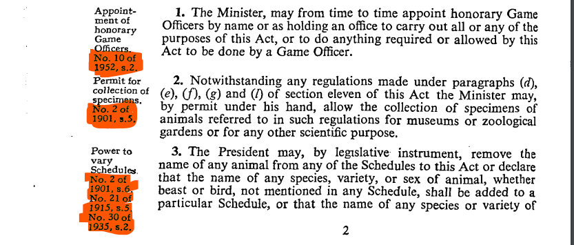
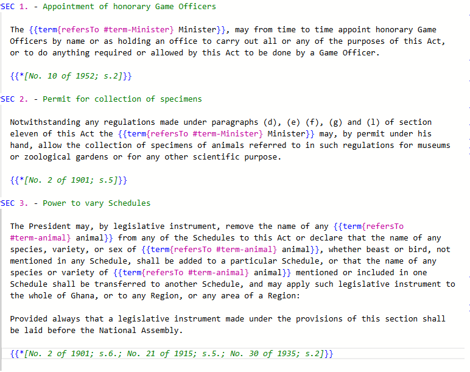
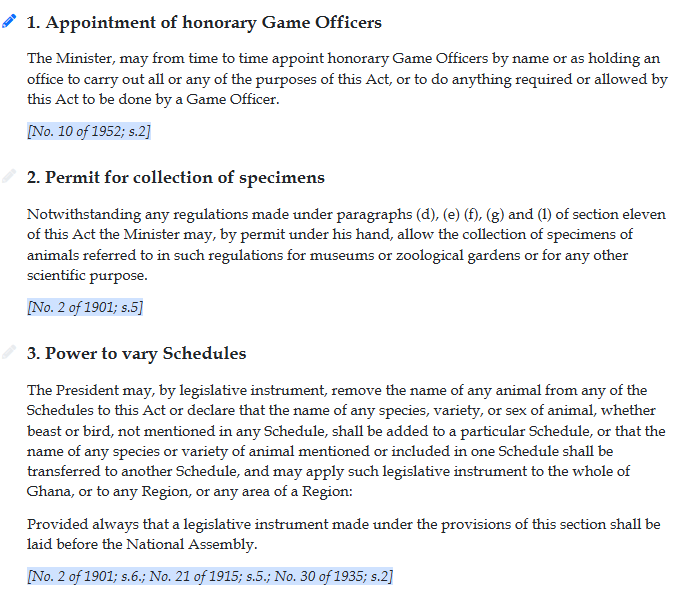
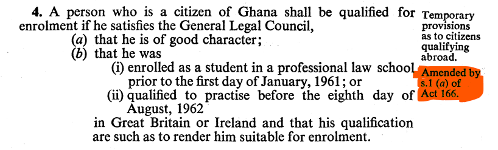
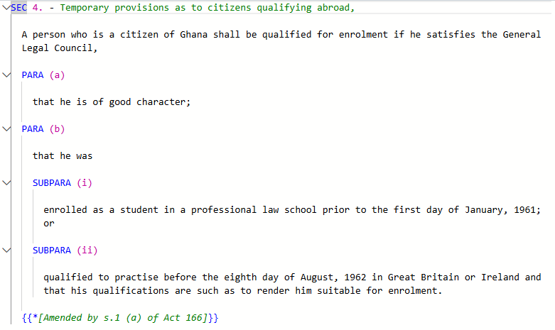
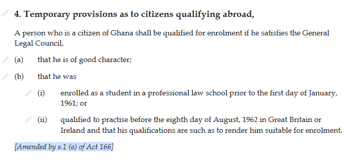
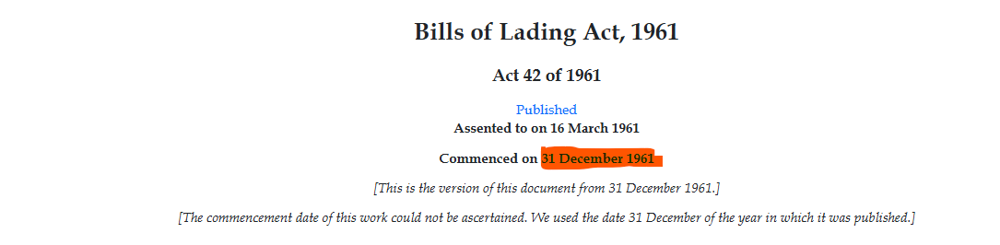
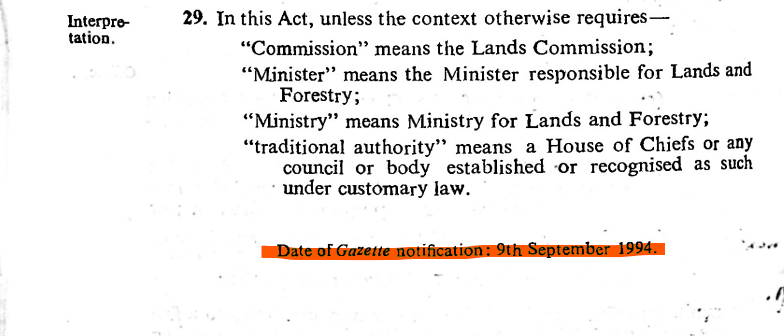

# Ghana

## Import documents

**Word docs:** [https://drive.google.com/drive/folders/1hrqHA9umhr5fLtqd0Ws-6iLYeAx5epq0](https://drive.google.com/drive/folders/1hrqHA9umhr5fLtqd0Ws-6iLYeAx5epq0)

## Cleaning up a document

### Annotations

References to Acts in the headings' margins should be moved to the end of the section and marked up as an annotation. Where several references appear, they should be captured in a single annotation separated by semi-colons.

<figure><figcaption></figcaption></figure>

<figure><figcaption></figcaption></figure>

<figure><figcaption></figcaption></figure>

References to Acts in the margins should be moved below the text they refer to, and be marked up as annotations.

<figure><figcaption></figcaption></figure>

<figure><figcaption></figcaption></figure>

<figure><figcaption></figcaption></figure>

References to amendments should also be captured as annotations.

<figure><figcaption></figcaption></figure>

<figure><figcaption></figcaption></figure>

<figure><figcaption></figcaption></figure>

## Dates in Ghana

We do not have publication or commencement dates for Acts up to the year 1992. We will be using dummy commencement dates (31/12/year) for such years.

<figure><figcaption></figcaption></figure>

For years after 1992, the date of Gazette notification is the same as the publication date.

<figure><figcaption></figcaption></figure>

Documents commence on the publication date unless stated otherwise.

The date Gazette notification which appears at the end of the task should be deleted.

## Things to note

* Some original publications have incomplete words. This may lead to OCR errors in the imported tasks e.g the currency symbol for Ghana appearing as '€, £ or 0' instead of '₵'. Look out for these when cleaning the imports.
* The format of some Schedules deviate from the usual ones, where instead of paragraphs, we have Articles and Rules.
* In some documents, there is a reference to Rules in the main body, but in the Schedules, these Rules are referred to as paragraphs. When marking these up in the Schedule, we should use PARA instead of RULE.

