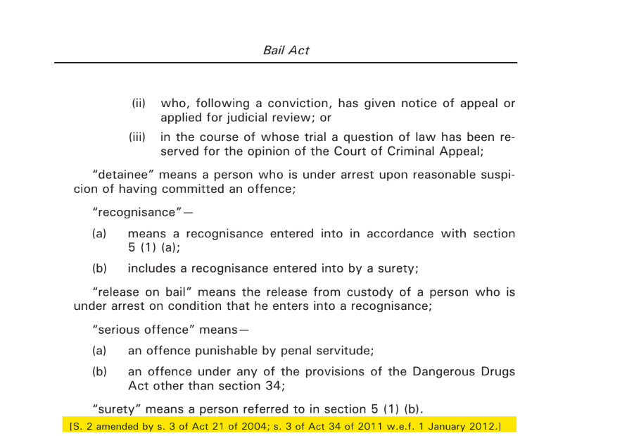
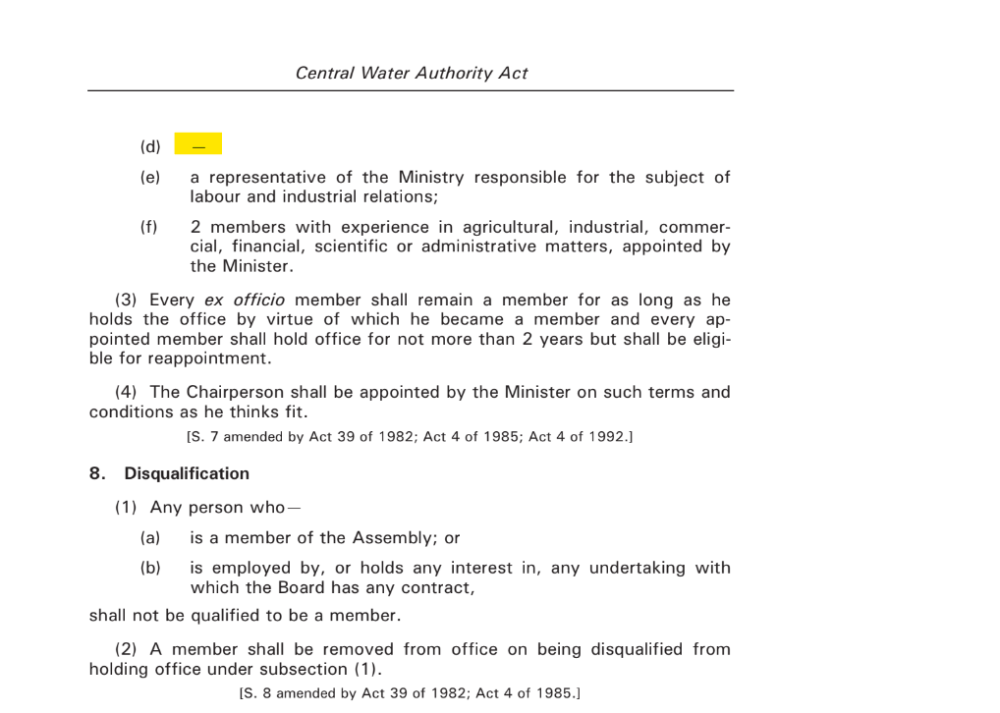
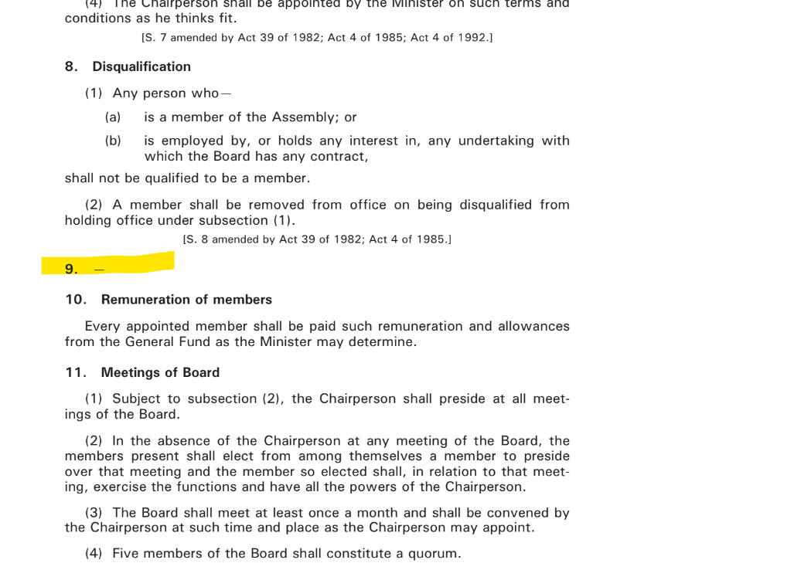
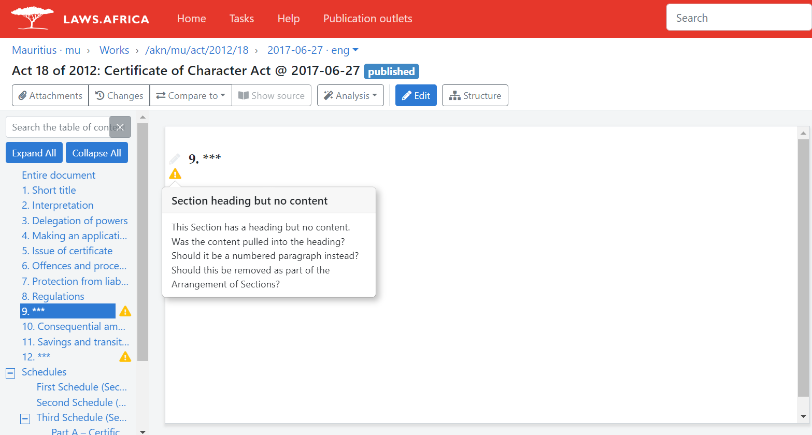
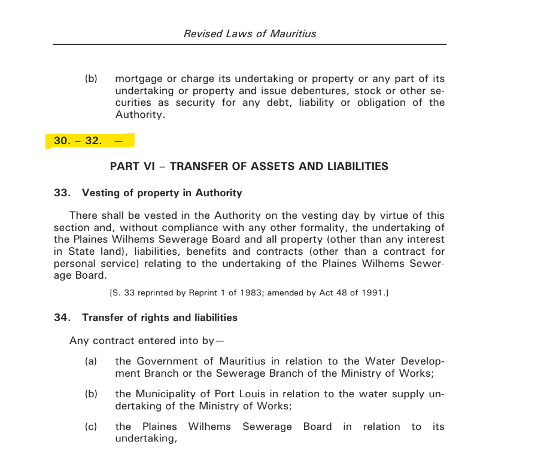

# Mauritius

Documents for import

Please use Word documents for import, and PDF documents to compare against.&#x20;

PDF and Word documents are saved here [https://drive.google.com/drive/folders/1N2oRYyCLIXVhtA5MNL-JDV7IPlyRGGov?usp=share\_link](https://drive.google.com/drive/folders/1N2oRYyCLIXVhtA5MNL-JDV7IPlyRGGov?usp=share\_link)

## Cleaning up imports

### Things to look out for in Mauritius

#### Annotations

Please do not change the wording of annotations. These should be left as they are and marked up as a remark/annotation.&#x20;

<figure><figcaption><p>The highlited annotation should be marked up as shown below.</p></figcaption></figure>


```markup
{{*[S. 2 amended by s. 3 of Act 21 of 2004; s. 3 of Act 34 of 2011 w.e.f. 1 January 2012.]}}
```


Certain annotations will appear in round brackets, such as in the example below. These should be marked up as an annotation/remark. &#x20;

<figure><figcaption><p>How this annotation should be marked up is shown below. </p></figcaption></figure>


```markup
{{*[Subsec. (6) not in operation.]}}
```


#### Blank sections, subsections and paragraphs etc.

Some portions of Mauritius documents will be blank or empty. Below is an example of one such instance.&#x20;

<figure><figcaption></figcaption></figure>

When a element that does not usually have a heading is blank, mark it up as it appears in the PDF. Blank paragraph (d) in the image above should be marked up as follows:


```markup
PARA (d)
    -
```


Multiple blank subsections/ paragraphs or a range of blank subsections/ paragraphs, should be marked up as follows.


```markup
SUBSEC (2) 
    -
SUBSEC (3) 
    -
SUBSEC (4) 
    -
```


Below is an example of a blank section and how it should be marked up.

<figure><figcaption></figcaption></figure>


```markup
SEC. 9 - ***
```


<figure><figcaption><p>Please ignore the warning that will appear.</p></figcaption></figure>

Below is an example of multiple blank sections or a range of blank sections,  and how they should be marked up.

<figure><figcaption></figcaption></figure>


```markup
SEC 30. - ***
SEC 31. - ***
SEC 32. - ***
```

