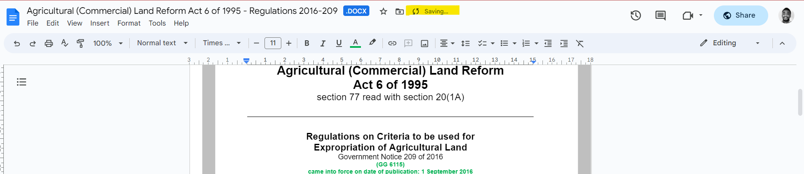
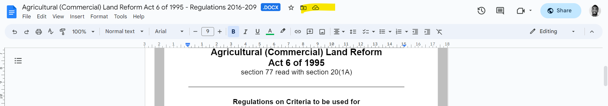
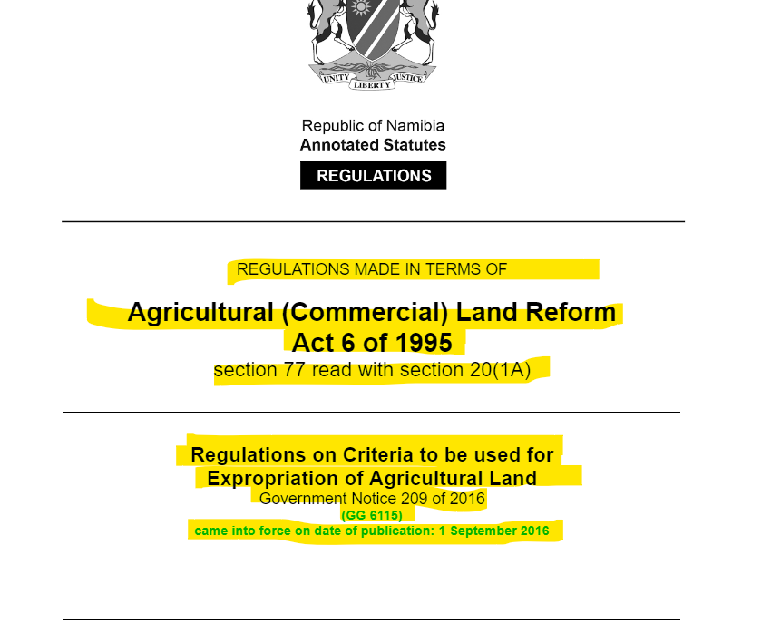
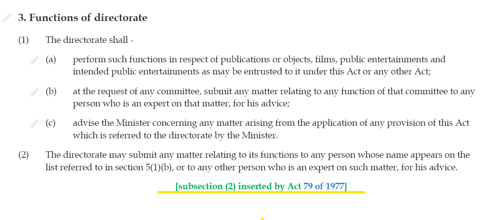

# Regulations

**Import documents:**&#x20;

**Word docs:** [https://drive.google.com/drive/u/1/folders/1qo3sbs99zh75BVri3AstNf8Y9NrwrAJT](https://drive.google.com/drive/u/1/folders/1qo3sbs99zh75BVri3AstNf8Y9NrwrAJT)

## Things to look out for

### Before the import

#### Table of Contents

The Word documents have a Table of Contents (ToC) of an "Arrangement of Regulations". This needs to be removed in each document before it can be imported. To remove the ToC:

* find the document you want to import in the ["Import documents" folder](https://drive.google.com/drive/u/1/folders/1qo3sbs99zh75BVri3AstNf8Y9NrwrAJT)
* open the document in Google docs (before downloading it)
* delete the Toc or Arrangement of Regulations (<mark style="color:red;">text is in red</mark>)&#x20;
* wait for it to save

<figure><figcaption>
saving...
</figcaption></figure>

<figure><figcaption>
saved
</figcaption></figure>

* close the document
* download the newly edited document
* import the downloaded document

### Cleaning up the import&#x20;

#### Preface

Please remove the text that comes immediately after the Namibian coat of arms or logo, and before the "arrangement of regulations"

<figure><figcaption>
The highlighted text should be removed
</figcaption></figure>

#### Headings

**Chapter, Part** and **Schedule** headings should be marked up in all caps.

<figure><figcaption></figcaption></figure>

#### Forms

Forms are not to reproduced when importing regulations.

\
For Forms, please still insert the heading and style as usual, with an editorial note underneath, as shown below:

<pre><code><strong>ANNEXURE - Annexure 1
</strong>    SUBHEADING Forms
    {{*[Editorial note: The forms have not been reproduced]}}
</code></pre>

#### Tables

Tables in Schedules **must** be imported.&#x20;

## Good to know

### Annotations

Annotations will look a little different in Namibia. They are automatically centre aligned and in green.

