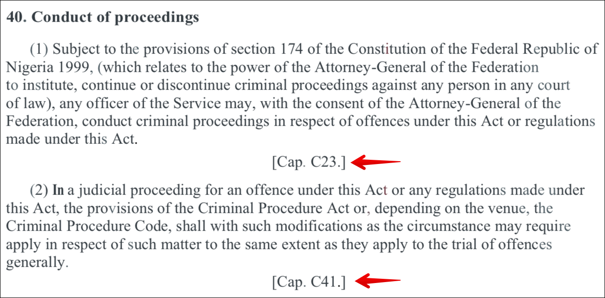
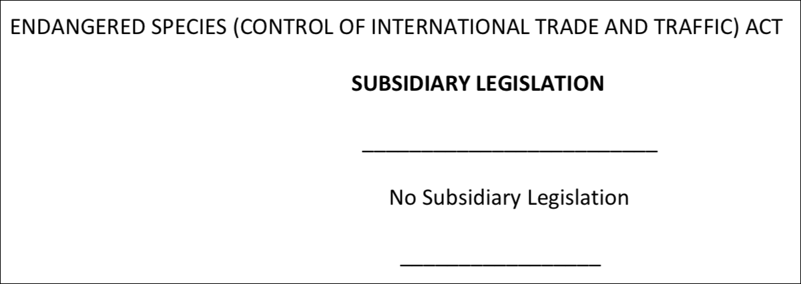

# Nigeria

## Cleaning up

### Editorial remarks


Do not remove remarks that indicate amendments, such as `[1992 No. 59]`.




Do use double squares around editorial remarks in Edit mode: `[[1992 No. 59.]]`\
This will show up as italics, single square brackets in View mode: _\[1992 No. 59.]_


Remove remarks that reference Caps and Schedules.



### Subsidiary legislation

Remove any subsidiary legislation after the Act, including if it says 'No subsidiary legislation'. Delete the name of the Act as well.&#x20;




.png>)


The document should end with the last Schedule to the main Act, or with the last section of the main Act if it has no Schedules.


## Use Sections in Schedules

Prefer to use Sections in Schedules rather than Crossheadings.


If a title appears to belong to only one numbered Section, mark it as a Section, not as a Crossheading.


.png>)

Mark up these sections like this:

```
  SEC 1. - Supplementary provisions as to the Corporation

    SUBSEC (1)

      A member of the corporation may at any time ...

    SUBSEC (2)

      If the chairman is appointed to be ...

    SUBSEC (3)

      If the chairman is absent from ...

  SEC 2. - Eligibility for reappointment

    A member of the Corporation who ...
```
