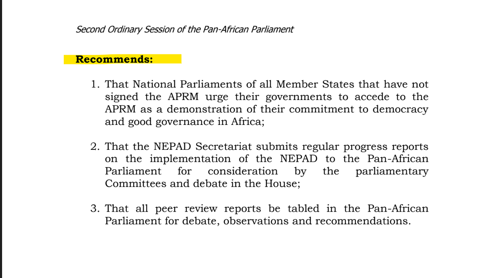
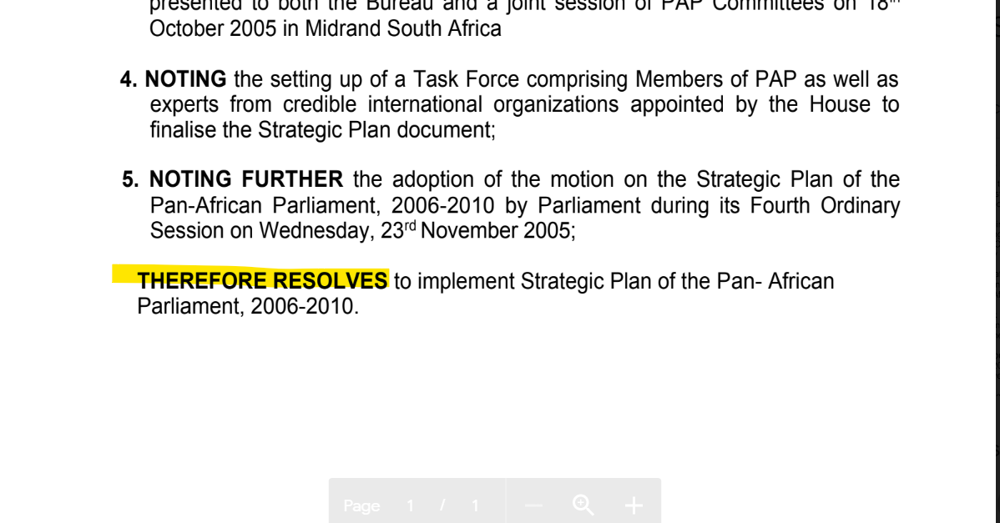
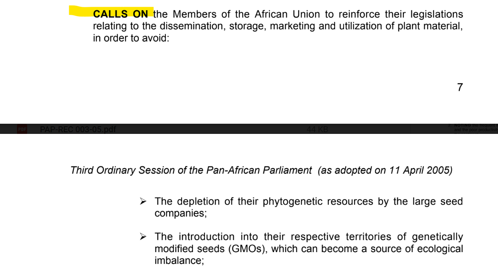

# Pan-African Parliament/ AGP

## Pan-African Parliament

### Recommendations and Resolutions

#### Preamble and Preface&#x20;

In PAP documents, we use `PREAMBLE` for text like \
"_The Pan-African Parliament,_\
_Recalling X,_\
_Noting of Y, etc."_

We haven't yet found a use for `PREFACE`.

#### Body&#x20;

The `BODY` in Recommendations usually begins as is highlighted in the example below.

The `BODY` in Resolutions usually begins as is highlighted in the example below.

Below are other examples of the `BODY` of Recommendations and Resolutions.&#x20;

 

#### Documents without a preamble

Sometimes a document will not have a preamble. In such instances, the first keyword used should be `BODY`. Below is an example of one such document.

.png>)

#### Hierarchical structure

Within the main body and in Schedules, content is often grouped under headings.

In legislation, the most common groupings are Chapters and Parts.&#x20;

For PAP documents, which often don't specify what these headings are called, we use Divisions and Subdivisions.

The most common grouping of content is numbered paragraphs.

#### Keywords most commonly used&#x20;

`DIVISION`

`SUBDIVISION`

`PARA`

`SUBPARA`

## AGP

### General 

#### Preface and preamble 

In AGP treaty documents, we use `PREAMBLE` for text like "_The African Union, Recalling X, Noting of Y, etc."_ We haven't yet found a use for `PREFACE`.

In the Preamble of a document, style the first word of each sentence (words highlighted in the image below) as it is in the source document. If such word it **underlined**, please remove the underlining and **add italics** to it.&#x20;

#### Body 

The `BODY` in treaties usually begins **after** the phrase "Have agrees as follows", as is highlighted in the example below.

#### Documents without a preamble 

Sometimes a document will not have a preamble. In such instances, the first keyword used should be `BODY`.

#### Hierarchical structure 

Within the main body and in Schedules, content is often grouped under headings. The most common groupings are Chapters and Parts. For groupings not specified as either a Parts, Chapters or other keyword, we use Divisions and Subdivisions. The most common grouping of content is numbered articles or paragraphs .

#### Keywords most commonly used 

`CHAPTER/ PART`

`ARTICLE`

`PARA`

`SUBPARA`

If a document is divided by headings for which a keyword exists, such as `CHAPTER/PART`, please use `SUBPART`  for any further headings which do not have a keyword.

If a document is divided by headings for which a keyword does  not exist, please use `DIVISION`  and `SUBDIVISION`  for those headings.

#### Things to look out for

.png>)

 (1).png>)

Please fix spacing errors. Please add a comment in the margin ONLY if adding a space changes the meaning of the sentence.

Please remove signatures that appear at the end of documents.

 (1).png>)

#### &#x20;
