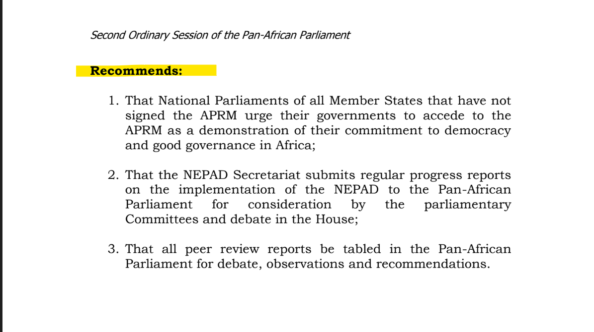
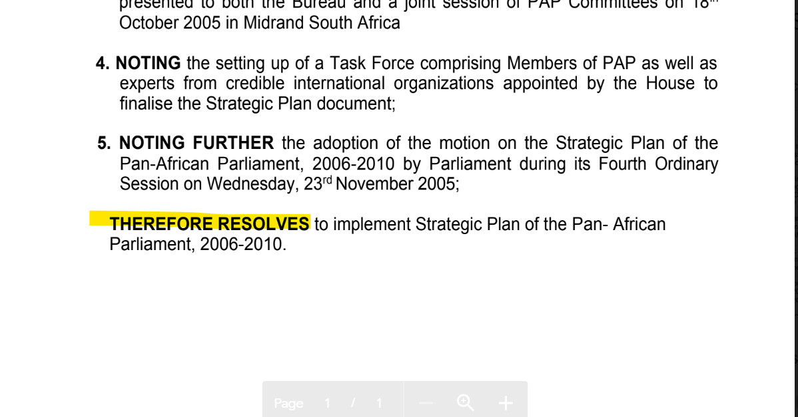
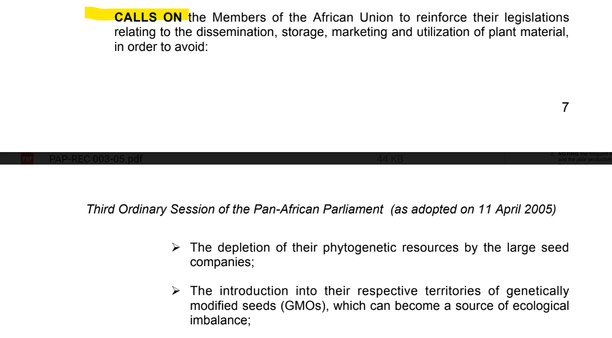
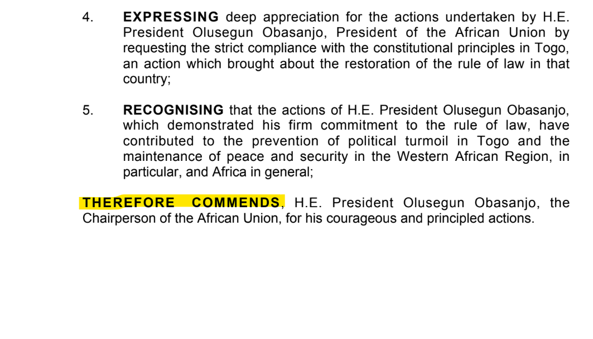

# Pan-African Parliament

## Recommendations and Resolutions

### Preamble and Preface&#x20;

In PAP documents, we use `PREAMBLE` for text like \
"_The Pan-African Parliament,_\
_Recalling X,_\
_Noting of Y, etc."_

We haven't yet found a use for `PREFACE`.

The `BODY` in Recommendations usually begins as is highlighted in the example below&#x20;

The `BODY` in Resolutions usually begins as is highlighted in the example below&#x20;

Below are other examples of the `BODY` of Recommendations and Resolutions&#x20;

 

### Hierarchical structure

Within the main body and in Schedules, content is often grouped under headings.

In legislation, the most common groupings are Chapters and Parts.&#x20;

For PAP documents, which often don't specify what these headings are called, we use Divisions and Subdivisions.

The most common grouping of content is numbered paragraphs.

### Keywords most commonly used&#x20;

`DIVISION`

`SUBDIVISION`

`PARA`

`SUBPARA`
