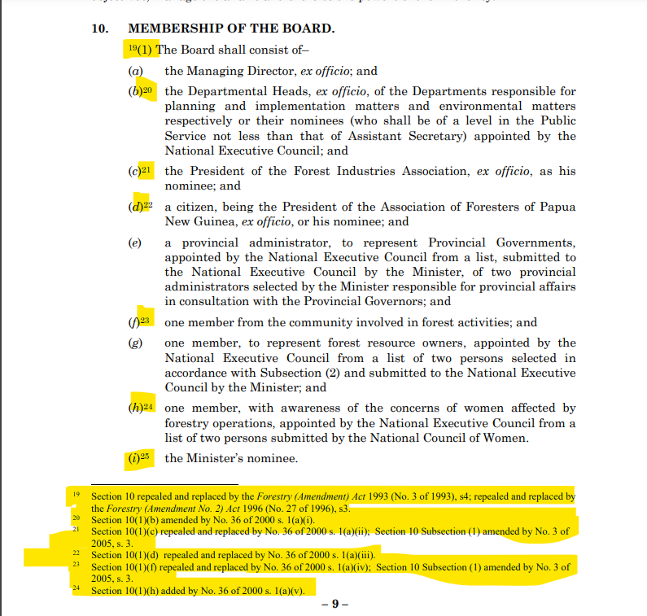

# Papua New Guinea

### Where to find documents

Please import from word (.docx) documents, found here: [https://drive.google.com/drive/folders/12uRt6n6D9nuevxMpxHDwD4HgWiTbhp1E?usp=share\_link](https://drive.google.com/drive/folders/12uRt6n6D9nuevxMpxHDwD4HgWiTbhp1E?usp=share\_link)

Please use PDF documents to check against. PDFs are found here: [https://drive.google.com/drive/folders/1csEuWRUsNm7SV4TylLq9KKNAYm0CCsle?usp=share\_link](https://drive.google.com/drive/folders/1csEuWRUsNm7SV4TylLq9KKNAYm0CCsle?usp=share\_link)

### Points in time

If a publication date and a consolidation date are provided, please import at the consolidation date.

If there is no consolidation date, but a publication date, please import at the publication date.&#x20;

If there is neither a consolidation date nor a publication date, please import at the commencement date.&#x20;

### Preface and long title&#x20;

Below is an example of a `LONGTITLE` and how it should be marked up.

<figure><figcaption></figcaption></figure>


```markup
PREFACE

  LONGTITLE Being an Act to -

  ITEMS
    ITEM (a)
      recognise the incorporation of Mineral Resources Development Company Limited as an entity that, together with its subsidiaries, holds on trust interests in petroleum, mining and unconventional hydrocarbons projects for beneficiaries including project area landowners, affected Provincial Governments and Local-level Governments; and

    ITEM (b)
      provide that the shares in Mineral Resources Development Company Limited are held on trust by the Prime Minister from time to time on behalf of the State; and

    ITEM (c)
      provide that Mineral Resources Development Company Limited and its subsidiaries are not the State or instrumentalities of the State and that their assets shall not be deemed as public assets; and

    ITEM (d)
      repeal the //Mineral Resources Development Company Pty Limited (Privatisation) Act// 1996, and for related purposes,

  MADE by the National Parliament to come into operation in accordance with a notice in the National Gazette by the Head of State, acting with, and in accordance with, the advice of the Minister.
```


### Things to remember

#### Statements of certification

Please DO NOT include statements of certification that appear and the end of a document

<figure><figcaption></figcaption></figure>

#### References of Acts

For references of Acts that are in bold text and italics, remove the bold text and keep the italics

<figure><figcaption><p>Highlighted text should be italicised but not boldened </p></figcaption></figure>

#### Marking up Parts

When marking up Parts, please remove the full stop after the number.

<figure><figcaption><p>Should be marked up as <code>PART I - PRELIMINARY</code></p></figcaption></figure>

### Documents that are consolidations

A consolidated document is one that is update with amendments up to a certain date. In Papua New Guinea, if a document is consolidated, please change footnotes of amendment information to editorial remarks.&#x20;

&#x20;

<figure><figcaption><p>The highlighted footnotes should all be captured as editorial remarks.  </p></figcaption></figure>

Use \{{\*\[remark]\}} to capture amendment information. Please pay attention to the position of each editorial remark. An editorial remark should be under the numbered item to which it relates. In the example above, footnote 19 refers to the entire section 10 and the editorial remark should be at the end of that section. &#x20;

For the annotations in the consolidated Acts:

Change "s." or "Section" to "section", "Subsection" to "subsection", "Paragraph" to "paragraph",  "Definition" to "definition",  "Proviso" to "proviso", "Long Title" to "long title", "Heading" to "heading" and "Item" to "item". The only ones that must remain capitalised are "Chapter", "Part" and "Schedule".

Remove the full stop at the end of the annotation (if there is one)

Please do not make any additional changes to the existing annotations, including the annotations in the definitions.
