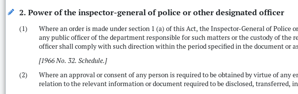

# South African By-laws

## Short titles

Because by-laws in South Africa are often missing a ‘short title’ section, and because they’re inconsistent with regard to casing, the placement of ‘by-law’, the inclusion of the municipality, etc., we’ve decided to standardise the titles for by-laws in the following ways:

1. Exclude **By-law relating to the** or any part thereof.
   * By-law relating to the Keeping of Dogs → Keeping of Dogs
   * By-law relating to Animals → Animals
2. Exclude **B/by-law/s** at the end of the title.
   * Animal by-law → Animal
   * Guns, Germs and Steel By-laws → Guns, Germs and Steel
3. Exclude **of the XYZ Municipality** or similar.
   * Liquor by-law of the Cape Town Metro Municipality → Liquor
   * Cape Town: Liquor by-law  → Liquor
   * Air Quality By-law of the Swartland Municipality → Air Quality
4. Include e.g. **\(Municipal Council of Piketberg\)** in brackets at the end of the title if this is a more local council / municipality than the \(e.g. District\) Municipality you’re working in.
5. Use lower case for these words: of, and, in, the, for, on.
6. Capitalise the first letter of all other words.

### **Example of by-law titles**

* Electricity Supply
* Fire Safety
* Keeping of Bees
* Municipal Planning
* Property Rates
* Rates
* Street Trading
* Tariff

## Capitalising headings

In South African by-laws, we use Sentence case for all headings – never all-caps.

### What is sentence case?

Sentence case capitalises the first word, any proper nouns and acronyms, and defined terms.

* To **capitalise** means to uppercase the first letter,  e.g. `namibia` → `Namibia`
* **Proper nouns** include country names and the names of certain bodies,  e.g. `attorney general` → `Attorney General` 
* **Acronyms** \(or [initialisms](http://www.todayifoundout.com/index.php/2012/05/the-difference-between-an-acronym-and-an-initialism/) if you want to be that person\) will often also be defined in the legislation,  e.g. '"**ITU**" means International Telecommunications Union;'
* **Defined terms** are defined in the definitions section of the current work,  e.g. '"**Board**" means the Board of Commissioners established under section 5 of this Act;'


If a term is defined in the lower case, it doesn't need to be capitalised when it appears in a heading.



If a term is consistently used in the upper case in a work, it should be used in the upper case in headings, even if it isn't explicitly defined.


### How to fix all-caps headings

1. In View mode, select 'Analysis \| Make section headings Sentence case'.
2. Review and fix section headings.
3. Don't forget Step 2.

### Tips

* Only run 'Make section headings Sentence case' when the headings are all caps.
* Run it as a first step, then check individual headings and re-capitalise proper nouns and acronyms.
* Never run it as a last step.
* 'Quick edit' sections that need words re-capitalised by clicking the pencil next to the heading.




In the example above, 'inspector-general of police' should match the casing in subsection \(1\).


### Exercise

* [ ] Copy and paste the text below into the editor.

```text
1. DEFINITIONS

Blah blah blah.

2. NATURAL RESOURCES IN NIGERIA

Blah blah blah.

3. THE SABC'S INVOLVEMENT IN THE OFFICIAL PROGRAMME

Blah blah blah. The Official Programme will be very official.

4. HOW THIS WILL AFFECT REGULAR PEOPLE

Blah blah blah.


```

* [ ] Click Update.
* [ ] Select 'Analysis \| Make section headings Sentence case'.
* [ ] Quick edit sections 2 and 3 to fix their headings.

