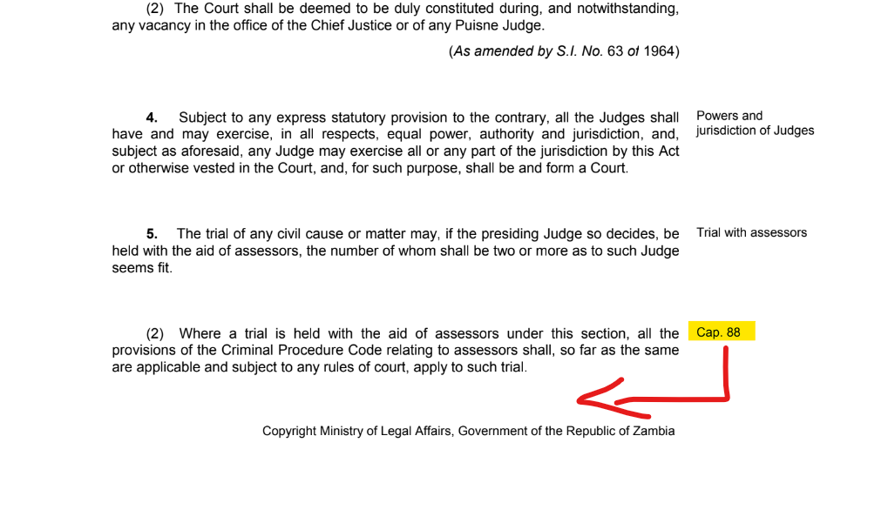
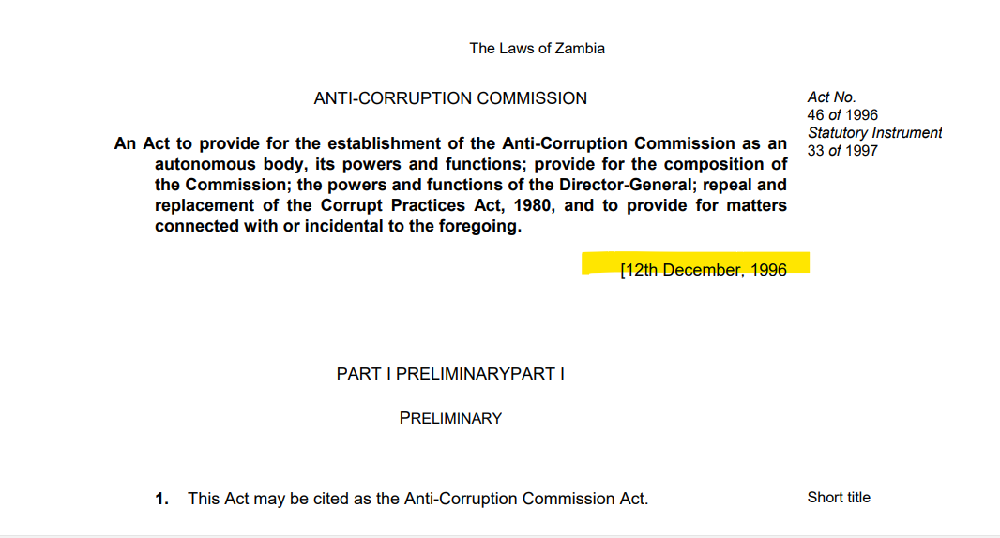
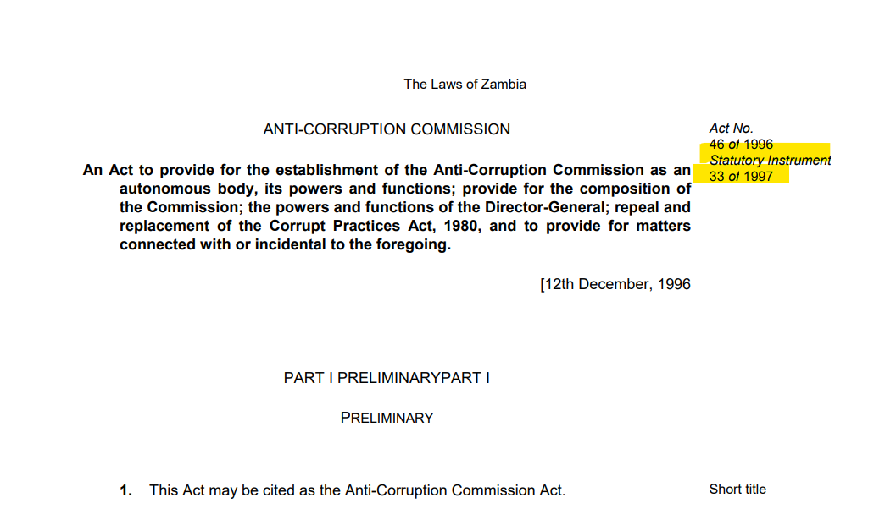

# Zambia

### Where to find documents

#### 1996 Consolidation

PDFs for reference: [https://drive.google.com/drive/folders/1bKsOYDXu5wiHncPlKnqfuVK2PHVFJ-RD?usp=share\_link](https://drive.google.com/drive/folders/1bKsOYDXu5wiHncPlKnqfuVK2PHVFJ-RD?usp=share_link)

Word documents: [https://drive.google.com/drive/folders/1hHI\_zNcF0vePS8xV88lYVp7pf\_uP\_tGj?usp=share\_link](https://drive.google.com/drive/folders/1hHI_zNcF0vePS8xV88lYVp7pf_uP_tGj?usp=share_link)

#### Update documents

These are for documents if a date after 31 December 1996. [https://drive.google.com/drive/folders/1IecOPTPKGZKJizv4Gk1CJd5UmrzXglQ6?usp=share\_link](https://drive.google.com/drive/folders/1IecOPTPKGZKJizv4Gk1CJd5UmrzXglQ6?usp=share_link)

### Cleaning up a document&#x20;

#### Legislation history

References to legislation history, as highlighted in the image below, must be captured in a single annotation above the LONGTITLE.

<figure><figcaption><p>An example of how to mark up the text in this image is captured below.</p></figcaption></figure>


```
PREFACE

  {{*[22 of 1976; 20 of 1977; 21 of 1988; 10 of 
  1997]}}

  LONGTITLE An Act to prescribe the number of Supreme 
  Court judges and of puisne judges of the High Court.

BODY

SEC 1. - Short title 

  This Act may be cited as the Supreme Court and High       
  Court (Number of Judges) Act.
```


#### Annotations

Statements indicating amendments should be captured as annotations. `{{*[text text]}}`

<figure><figcaption></figcaption></figure>

References to Acts in the margins should be moved below the text to which they refer and marked up as an annotation. Where several references appear, these should be captured in a single annotation separated by semi-colons.&#x20;

<figure><figcaption></figcaption></figure>

#### Applying Amendments

When applying amendments to legislation, follow these guidelines:

1. **Retain Original Annotations from Consolidations**\
   Keep annotations like "(As amended by...)" as they appear in the consolidated version. These reflect the original consolidation notes and must not be altered.
2. **Add New Annotations Below Consolidation Annotations**\
   Include new annotations for applied amendments in the house style, placed directly **below the retained consolidation annotation**.
3.  **Example:**\
    Original consolidation annotation:\
    &#x20;      \[`As amended by Act No. 31 of 1976]`

    Added new annotation:\
    &#x20;     `[section 14(3) substituted by Act 15 of 2005]`

    Final format:\
    &#x20;     \[`As amended by Act No. 31 of 1976]`\
    &#x20;     \[`section 14(3) substituted by Act 15 of 2005]`

### Dates in Zambia

The date in square brackets under the long title of an Act is a **publication date**.

<figure><figcaption><p>Publication date</p></figcaption></figure>

**In a consolidated document,** refences to a statutory instrument, in the legislation history, can either be an amendment or a reference to a statutory instrument that commenced the Act. If there is no such reference in the margin, the commencement date is the same as the publication date.&#x20;

<figure><figcaption><p>SI 33 of 1997 commenced this Act. </p></figcaption></figure>


**If the document is a gazette** and not a consolidation, the commencement date will be the same as the publication date, if the Act does not state that the Act will commence by proclamation in the gazette.&#x20;
