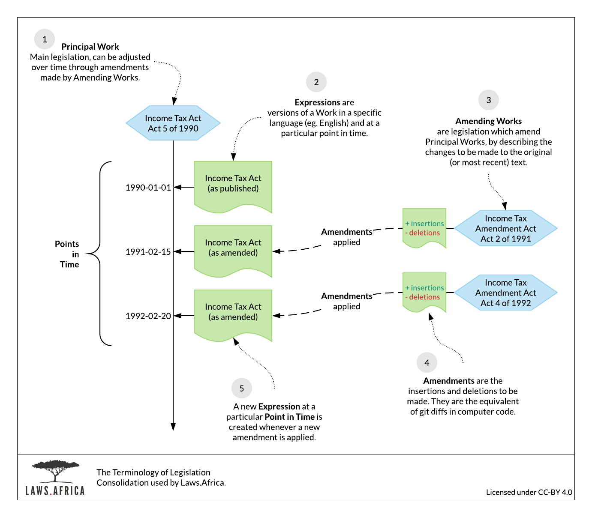

# Terminology guide

A **Work** is the logical concept of an Act or other piece of legislation. A Work may change over time through amendments or be issued in multiple languages. A Work may ultimately be repealed.

An **Expression** is a particular version of a Work, in a specific language and at a particular Point in Time. A Work may have many expressions associated with it.

An **Amending Work** is an Act or other legislation that makes changes to another Work \(the **Principal Work**\). Amending Works are published when government needs to update or change an existing piece of legislation.

A **Commencing Work** is normally a notice, but can also be another Act, that provides the Commencement date for a Principal Work.

**Amendments** are the changes that are applied to a Work by an **Amending Work**. They are instructions of insertions and deletions that must be made to the text of the Work being amended.

When a Work is **Repeal**ed, it is no longer in force. This is done by a **Repealing Work**, and the date of the repeal is the date on which the Repealing Work comes into force. Repealing Works are published when the government needs to remove or replace an existing piece of legislation.

A **Point in Time** is all the Expressions of a Work on a particular date. There is usually only one Expression at a particular date, unless the Work is available in multiple languages. Often, a Point in Time is synonymous with an Expression. Each point in time will have all the previous amendments applied to it, and the oldest point in time will be the work as originally published.

**Subsidiary legislation** are regulations, statutory instruments and orders which are related to a primary Act.

### Dates

**Assent**: The date on which the work is approved by the relevant authority.

**Publication**: Usually in the Gazette.

**Commencement**: The date on which a work comes into force. If nothing is specified, it is often the publication date; to double-check, read the Interpretation Act of the country in which you’re working.   
Amendments to Principal Works come into force on the Commencement date of the Amending Work.   
The Repeal of a Work come into force on the Commencement date of the Repealing Work.

### Abbreviations

| Abbreviation | Meaning |
| :--- | :--- |
| GenN | General Notice |
| GG | Government Gazette |
| GN | Government Notice |
| LN | Legal Notice |
| Proc | Proclamation |
| PG | Provincial Gazette |
| PN | Provincial Notice |
| SI | Statutory Instrument |

